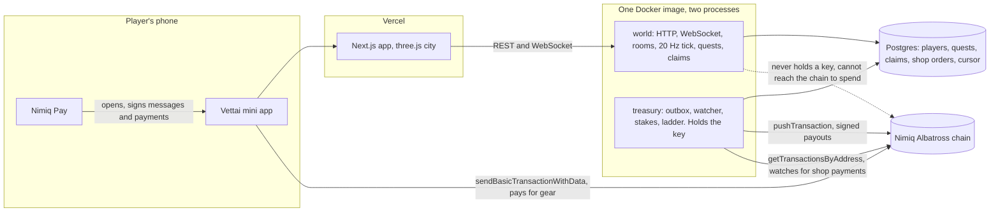
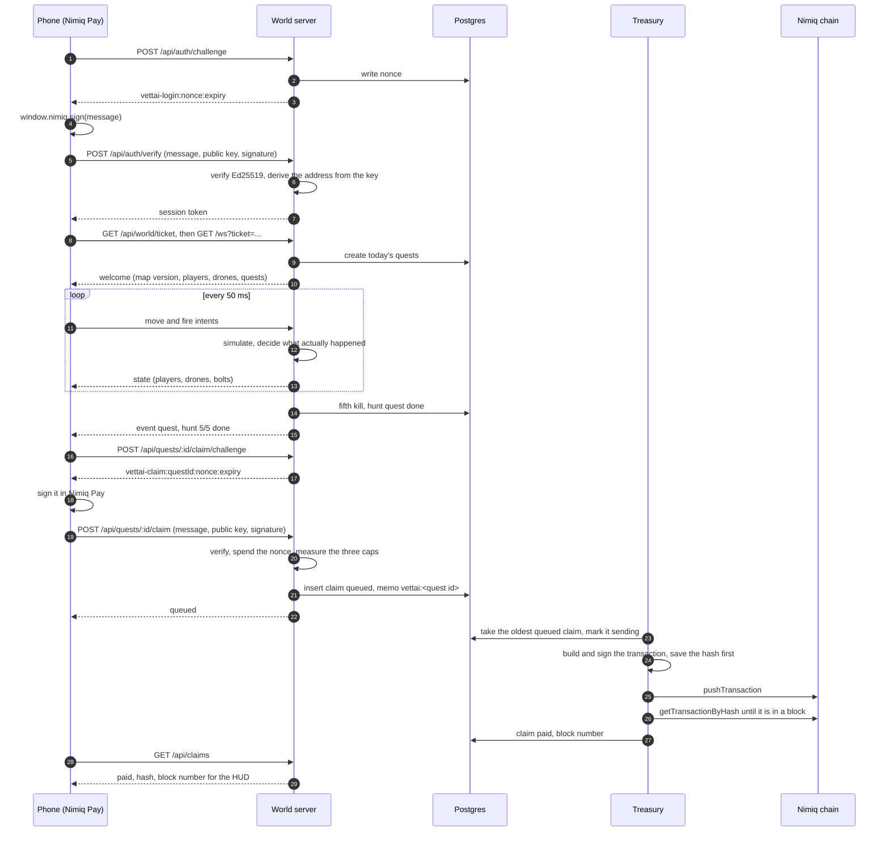
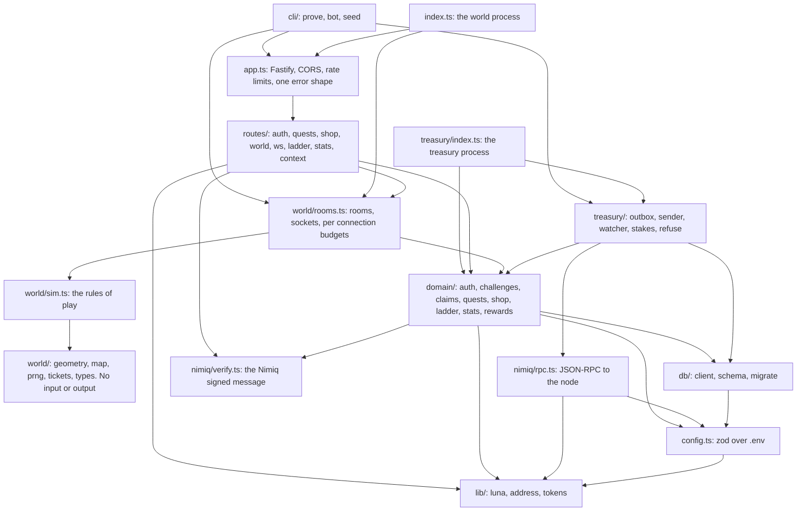

# Vettai architecture

Vettai is a third-person city game that runs inside Nimiq Pay. The server is the authority
for play. The Nimiq chain is the ledger for money. This file is the contract between the
world server, the treasury, and the client. Diagrams are added when the code lands.

## Processes

Two processes from one Docker image, one Postgres database.

- `world` (`src/index.ts`): HTTP API and WebSocket. Runs the rooms, the 20 Hz tick, the
  quest engine, the ladder, and the claim API. Never holds a private key.
- `treasury` (`src/treasury/index.ts`): delivers queued claims as NIM payments, watches
  the treasury address for shop payments, reads stakes for the landlord quest, pays the
  weekly ladder. The only process with `TREASURY_PRIVATE_KEY`.

The host picks which process runs by setting `VETTAI_PROCESS=src/treasury/index.ts`.
Unset, the image runs `world`. Locally the treasury reads its key from
`packages/server/.env.treasury` on top of `.env`; the world refuses to boot if it sees
`TREASURY_PRIVATE_KEY` at all. On Railway each service has its own variables.

## Environment

| Key | Used by | Meaning |
|---|---|---|
| PORT | world | HTTP and WebSocket port, default 8788 |
| DATABASE_URL | both | Postgres URL; unset means PGlite under `.data/vettai` (local and tests) |
| NIMIQ_RPC_URL | both | `https://rpc.nimiqwatch.com` mainnet, `https://rpc.testnet.nimiqwatch.com` testnet |
| NIMIQ_NETWORK | both | `MainAlbatross` or `TestAlbatross`, must match the URL |
| TREASURY_ADDRESS | both | The address that pays players and receives shop payments |
| TREASURY_PRIVATE_KEY | treasury | 64 hex, never set on `world` |
| POOL_TOTAL_NIM | both | Hard stop: sum of queued, sent and paid claims never exceeds this |
| DAILY_CAP_NIM | both | Per wallet per UTC day, across every reward kind |
| IP_WALLETS_PER_DAY | world | Distinct wallets that may claim from one IP per UTC day, default 2 |
| ALLOWED_ORIGINS | world | Comma list for CORS; blank means same-origin only through the web rewrite |
| MAP_SEED | world | Deterministic map seed, default `vettai-1` |
| LANDLORD_MIN_NIM | both | Stake that completes the landlord quest, default 10 |
| LANDLORD_ENABLED | both | `true` to generate landlord quests; default `false` until Ram decides |
| IP_SALT | world | Salt for hashing client IPs; a fixed dev string when unset |
| TRUST_PROXY | world | Blank locally. Otherwise a comma list of trusted proxy peers: named presets (`loopback`, `linklocal`, `uniquelocal`) or CIDRs. Fastify 5 ignores a plain hop count on purpose, and `true` would let any direct caller forge the client IP. Verify after deploy with `GET /api/echo-ip` |
| PUBLIC_WS_URL | world | The `wss://<world domain>/ws` address handed to the browser with its ticket. Blank means same origin. Needed whenever the web app fronts the API with a rewrite, since rewrites do not carry WebSocket upgrades |
| VETTAI_PROCESS | both | Entry script; `src/treasury/index.ts` makes the image run the treasury, unset runs the world |
| REWARD_HUNT, REWARD_COURIER, REWARD_LANDMARKS, REWARD_LANDMARKS_REPEAT, REWARD_LANDLORD | both | Quest rewards in NIM; defaults in the "Quests" table below |
| LADDER_PRIZES_NIM | both | Comma list of weekly prizes for first, second, third; default `2,1,0.5` |

All of it is validated with zod at boot in `src/config.ts`. A missing key fails loudly.

## Database (Drizzle, Postgres, PGlite for tests)

- `players`: address (primary), public_key, created_at, last_seen_at, last_ip_hash,
  gear (jsonb: `{ blaster: 'mk1' | 'mk2', skin: string, sprint: boolean }`), landlord_since.
- `sessions`: token_hash (primary), address, created_at, expires_at (30 days).
- `challenges`: nonce (primary), kind (`login` | `claim` | `shop`), subject (claim id or
  order id or null), expires_at, used_at. Single use, 10 minutes.
- `quests`: id (uuid, primary), address, day (UTC date), kind (`hunt` | `courier` |
  `landmarks` | `landlord` | `streak`), target (int), progress (int), state (`open` |
  `done` | `claimed`), reward_luna, detail (jsonb: courier `{ from, to, pickedUpAt }`,
  landmarks `{ visited: number[] }`), created_at, done_at. Unique (address, day, kind).
- `claims`: id (uuid, primary), address, quest_id (nullable for ladder prizes), kind,
  amount_luna, state (`queued` | `sending` | `sent` | `paid` | `failed` | `held`),
  memo, tx_hash (unique, nullable), block_number, ip_hash, created_at, sent_at,
  paid_at, error, attempts (int, retries so far), held_until (when a held claim is next
  re-evaluated). A quest may have at most one claim: unique (quest_id) where not null.
- `shop_orders`: id (uuid, primary), address, item, price_luna, memo (unique), state
  (`pending` | `paid` | `expired`), tx_hash (unique, nullable), block_number, created_at,
  paid_at, announced_at (when the live player received the gear event).
- `received_payments`: every incoming transaction the watcher inspected: tx_hash
  (primary), sender, recipient, value_luna, memo, block_number, block_time, order_id,
  outcome (`paid` | `short` | `expired` | `unknown_memo` | `sender_mismatch` |
  `already_paid`), seen_at. Money that arrived is never only a log line.
- `ladder_periods`: period (text primary, `2026-W41`), paid_at, claim ids (jsonb).
- `stats_daily`: day (primary), players, kills, paid_luna. Updated by the world.
- `watch_cursor`: address (primary), last_block_number, updated_at. Treasury watcher
  progress; the watcher pages by block number, and a transaction is matched at most
  once because the memo's order is unique and the tx hash is unique.

Money amounts are integers in luna (1 NIM = 100,000 luna). Never floats.

## Identity

Login is Vango's flow: `POST /api/auth/challenge` returns `vettai-login:<nonce>:<exp>`;
the client signs it with `window.nimiq.sign`; `POST /api/auth/verify` rebuilds the Nimiq
signed-message hash, verifies Ed25519 with the public key, derives the address from the
public key, consumes the nonce, and returns a session token `vt1.<random>` stored hashed.
The client never states its own address.

## Map

`src/world/map.ts` generates the city from `MAP_SEED` with a seeded PRNG. Same JSON on the
server and the client, served at `GET /api/world/map` with `version`.

- 12 by 12 lots of 16 m with 8 m streets: a 288 m square, origin at the centre, y up.
- Each lot is empty, a park, or a building `{ lot, type: 0..19, height, aabb }`.
- Fixed places: `office` (quest board, spawn), `shop`, four `landmarks`, eight `courier`
  points, and `patrol` waypoint loops for drones along streets at 6 m height.
- Everything the client needs to draw the block and the server needs to collide is in
  this JSON. Nothing else is hardcoded on either side.

## World simulation (`src/world/sim.ts`, pure functions, no I/O)

Tick: 50 ms. Units: metres, seconds, radians.

- Player: `{ id, x, z, yaw, vx, vz, shield: 0..3, downedUntil, lastFireAt, gear }`.
  Move intent `{ dx, dz }` is a unit vector or zero. Speed 6 m/s (mk1), 7 with the sprint
  gear. Integrate, then slide along building AABBs (axis-separated resolution), then
  clamp to the map bounds. A player can never end a tick inside a building.
- Drone: `{ id, x, y, z, yaw, hp: 3, state: 'patrol' | 'engage' | 'dead', waypoint,
  target, nextFireAt }`. Patrol 3 m/s along its loop. Engage when a player is within
  25 m: circle the player at 12 m radius and fire a bolt every 2 s. Max 6 alive per room,
  one respawn every 20 s at a random loop point.
- Bolt: `{ id, x, y, z, vx, vy, vz, ownerDrone, bornAt }`. Speed 12 m/s, straight line
  toward the target's position at fire time, dies after 3 s or on impact. Impact is a
  sphere-capsule test against each player (capsule radius 0.5, height 1.8). A hit costs
  one shield. Shield regenerates one bar every 8 s without a hit.
- Downed at shield 0: 3 s, then respawn at the office with full shield. Quest progress
  is kept.
- Fire intent `{ yaw, pitch }`: at most 4 per second (mk1) or 6 (mk2). Hitscan from the
  player's server position at eye height along the aim direction, range 60 m, with aim
  assist: the nearest live drone within a 6 degree cone counts as hit. Hit costs one hp.
  The player with the most damage on a drone gets the kill.
- Every function takes state in and returns new state plus a list of events:
  `hit`, `kill`, `downed`, `respawn`, `pickup`, `deliver`, `landmark`, `spawn`.
- Property tests: no player inside a building after any input sequence, speed never
  above the cap, fire rate never above the cap, drone count never above 6, a dead drone
  never deals damage, kill credit goes to the top damage dealer.

## Rooms and the socket (`src/world/rooms.ts`, `src/routes/ws.ts`)

- Rooms hold up to 24 players. A joining player goes to the least full open room. A
  room with nobody in it stops ticking after 30 s.
- `GET /api/world/ticket` (session required) returns a one-minute ticket. The socket is
  `GET /ws?ticket=...`. `permessage-deflate` is off (iOS WebViews drop compressed
  sockets).
- Client to server, JSON, `v: 1` on every message:
  - `{ t: 'move', seq, dx, dz, yaw }` at most 20 per second; extra ones are dropped.
  - `{ t: 'fire', seq, yaw, pitch }`.
  - `{ t: 'interact', target: 'office' | 'shop' | 'pickup' | 'deliver' | 'landmark:<n>' }`
    requires the player within 2.5 m of that place.
  - `{ t: 'ping', ts }`.
- Server to client:
  - `{ t: 'welcome', you, room, tick, mapVersion, players, drones, quests }` on join.
  - `{ t: 'state', tick, players: [changed only], drones: [all live], bolts: [all] }`
    every tick, players only when moved, a full players list every 40 ticks.
  - sim events (`hit`, `kill`, `downed`, `respawn`, `spawn`, `pickup`, `deliver`,
    `landmark`) ride on the `state` frame as `events: [{ kind, ... }]`.
  - `{ t: 'event', kind, ... }` only for the per-player and roster kinds: `quest`
    (progress or done, sent to that player only), `gear` (a shop order was paid, that
    player only), `join`, `leave`.
  - `{ t: 'pong', ts, serverTs }`, `{ t: 'error', code }`.
- Per-connection rate limits by message type, counted server side, never trusted from
  the client. A connection sending malformed JSON three times is closed.
- Every connection carries an id. A late `close` from a replaced socket only removes the
  connection with its own id, never the one that replaced it.
- Tick events are recorded in order: one promise chain in the world process, one
  transaction per batch, and a batch is dropped with a log line when the chain is more
  than 20 deep.
- The state frame is serialised once per room per tick and the tick's events ride on
  it as an `events` array, not as separate frames.

## Quests (`src/domain/quests.ts`)

Generated per player per UTC day on first request. Rewards are read from
`src/domain/rewards.ts`, integers in luna, overridable by env.

| Kind | Target | Done when | Reward |
|---|---|---|---|
| hunt | 5 kills | the sim reports the fifth kill credited to the player today | REWARD_HUNT (default 0.5 NIM) |
| courier | 1 delivery | pickup then deliver within 120 s, both by `interact` in range | REWARD_COURIER (0.3 NIM) |
| landmarks | 4 | `interact` at each of the four landmarks | REWARD_LANDMARKS (0.2 NIM), first day only, then 0.05 |
| landlord | 1 | the treasury saw a stake of at least LANDLORD_MIN_NIM on the wallet at its daily read | REWARD_LANDLORD (0.2 NIM); only if Ram enables it |
| streak | daily | one claim per UTC day, NimJump's curve: min(0.2 + 0.5 x (day minus 1), 10), capped by DAILY_CAP | as computed |

A quest at `done` becomes a claim only through the claim endpoint below. The weekly
ladder ranks kills per wallet, Monday 00:00 UTC to Sunday 23:59:59 UTC; the treasury pays
the top three from LADDER_PRIZES_NIM (default `2,1,0.5`) once per period.

## Claims (`src/domain/claims.ts`, the only path to a payout)

1. `POST /api/quests/:id/claim/challenge` (session): quest must be `done` and owned by
   the caller. Returns `vettai-claim:<questId>:<nonce>:<exp>`.
2. Client signs it. `POST /api/quests/:id/claim` with `{ publicKey, signature }`.
3. Server verifies the signature, derives the address, checks it equals the session's,
   consumes the nonce, then inside one transaction: quest to `claimed`, insert the claim
   as `queued` with memo `vettai:<questId first 8>` (under 64 bytes), unless a cap fails:
   - daily cap: paid plus queued plus sent for this wallet today, plus this amount,
     over DAILY_CAP_NIM: claim inserted as `held` with `error: 'daily cap'`.
   - IP cap: more than IP_WALLETS_PER_DAY distinct wallets from this IP hash today:
     `held`, `error: 'ip cap'`.
   - pool: total queued, sent and paid ever, plus this amount, over POOL_TOTAL_NIM:
     `held`, `error: 'pool'`.
   A hold is a delay, never a forfeiture: `held_until` is the next UTC midnight for the
   daily and IP caps, null for the pool. The treasury re-runs the cap check on held
   claims every minute (`releaseHeld`) and flips the ones that now pass to `queued`,
   which is also how a ladder prize held on Monday is paid later. The player sees
   "held until tomorrow" or "pool exhausted".
   The three cap checks run under two advisory transaction locks, the wallet's then a
   constant for the pool, so two claims arriving at once cannot both read the old sum.
   The quest update and the claim insert are one transaction. A streak reward is
   clamped at creation to what the daily cap still allows.
4. The treasury delivers `queued` claims (below). `GET /api/claims` lists the caller's
   claims with state, tx hash and block number.

## Treasury (`src/treasury/*`)

- `outbox.ts`: every 2 s, take up to 5 `queued` claims oldest first, mark each `sending`
  (save first), then send one at a time with 1.5 s between sends and no wait for
  inclusion between them. A `sending` row older than 10 minutes without a hash is
  retried once, then `failed`. Delivery is idempotent by claim id; a process restart
  never sends a claim twice because the state row is the lock. `attempts` is an
  integer column, never parsed from the error text.
- `sender.ts`: builds a basic transaction with the memo, signs with the treasury key
  (@nimiq/core), stores the hash, pushes over RPC. `settleInFlight` polls
  `getTransactionByHash` on later passes and marks `paid` with the block number. A
  lookup error is "still pending", never a resend. A hash the node still does not know
  after 15 minutes was never accepted: the claim goes back to `queued` with `attempts`
  incremented and is rebuilt with a fresh validity height; after three attempts it is
  `failed`.
- `watcher.ts` (Vango's watcher): scans the treasury address for incoming transactions,
  matches `vettai:shop:<orderId first 8>` memos against `pending` orders, checks sender
  equals the order's address and value at or above the price, marks `paid` with the
  hash and block. Orders expire 30 minutes after creation, judged against the block
  time of the payment, not the moment the watcher looked. Every inspected transaction
  is written to `received_payments` with its outcome.
- `stakes.ts`: once per UTC day (and once at boot) reads the stake of every player with
  an open landlord quest for that day and marks that day's quest done when at or above
  LANDLORD_MIN_NIM. Only the current day's quest can complete.
- `ladder.ts`: at Monday 00:05 UTC, pays the previous week if `ladder_periods` has no
  row for it, inside a transaction that inserts the row first.
- `refuse.ts`: the treasury refuses to start if TREASURY_PRIVATE_KEY does not derive
  TREASURY_ADDRESS, or if NIMIQ_NETWORK does not match the RPC's reported network.

## Shop (`src/domain/shop.ts`)

Items: `blaster-mk2` (faster fire), `sprint` (7 m/s), skins. `POST /api/shop/orders`
creates a `pending` order with memo `vettai:shop:<id first 8>` and returns
`{ orderId, to: TREASURY_ADDRESS, luna, memo }`. The client pays with
`sendBasicTransactionWithData`. `GET /api/shop/orders/:id` reports the state. The world
sweeps `paid` orders with no `announced_at` every 5 s, applies the gear to the live room
state, pushes a `gear` event to the player's socket, and only then stamps
`announced_at`; a player who is offline gets the gear at the next join from the player
row.

## Public reads (no session)

- `GET /api/stats`: players today, players all time, kills today, NIM paid all time,
  claims paid count, and `history`: the last seven UTC days from `stats_daily` (players,
  kills, paid luna as a string). The landing page reads this and nothing else.
- `GET /api/ladder/week`: top 10 this week by kills with addresses shortened.
- `GET /health`: `{ ok, network, room count, players online }`.

## Trust rules

- The client is never asked for a score, a position, or an address. It sends intents.
- The only process that can move NIM holds the key; the world cannot even reach it.
- Every payout has a memo with the quest id, so the chain is a public audit log.
- Caps bound the loss from a scripted client; they do not prevent one. The threat model
  says so in plain words.

## Diagrams

### System overview

Where each piece runs, and which of them can move money.

### One payout, end to end

The path a kill takes to become NIM in a player's wallet. Nothing in it trusts a number the
phone sent.

### Module dependency graph

`packages/server/src`, drawn folder by folder. The arrows only ever point downward: the play
simulation knows nothing about the database, the domain knows nothing about HTTP, and the
treasury is the only thing that reaches the signer.

