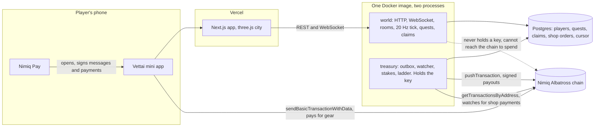
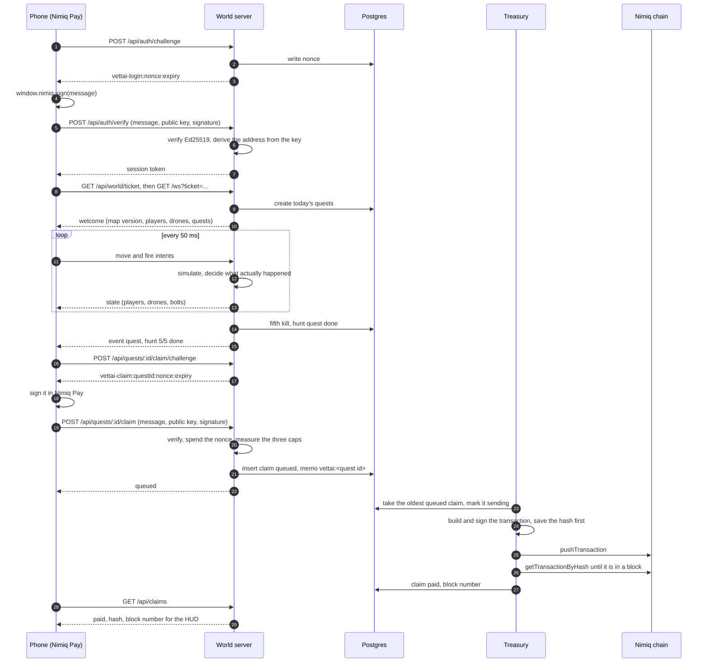
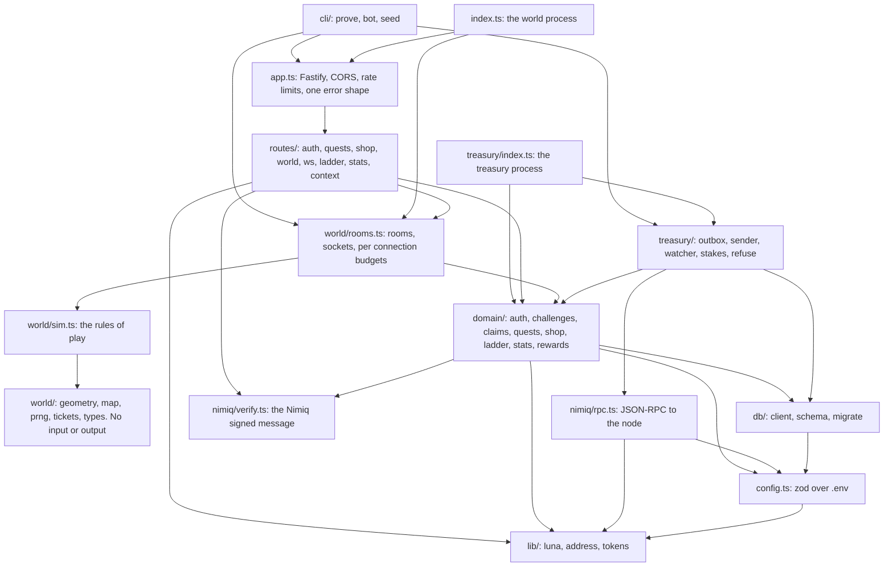

# Vettai

A third-person city you play inside your Nimiq Pay wallet. You hunt bounty drones, finish
today's quests, sign once, and real NIM lands in the wallet you are already holding.

Vettai is Tamil for "the hunt".

<p>
  
</p>

[Live app](https://vettai-web.vercel.app) · [Docs](https://vettai-web.vercel.app/docs) · [GitHub](https://github.com/ramakrishnanhulk20/vettai) · [Open in Nimiq Pay](https://nimpay.app/miniapps/open/vettai-web.vercel.app/play) · [Treasury on mainnet](https://nimiq.watch/#NQ69PKNUL14LDXNNK86Q0J812R97XMDPVEVH)

## Live deployments

| What | Value |
|---|---|
| App | `https://vettai-web.vercel.app` |
| Docs | `https://vettai-web.vercel.app/docs` |
| World API | `https://world-production-4620.up.railway.app` |
| Network | Nimiq mainnet (MainAlbatross) |
| Treasury | `NQ69 PKNU L14L DXNN K86Q 0J81 2R97 XMDP VEVH` |
| Reward pool | 1000 NIM, funded 17 September 2026 |

## Overview

Most wallet apps ask the wallet for one thing: a payment. Vettai asks it for four. The
wallet signs you in, so there is no account and no password. It signs each payout, so a
reward cannot be taken for a quest you did not finish. It pays the shop with a normal NIM
payment carrying a memo. And it stakes your own NIM for the landlord quest, which the
server reads back off the chain. That last one ships switched off, because asking a player
to stake their own money is the operator's call, not ours.

The money moves the other way round from a payment app. The game pays the player. A
bounty is a real transaction from the Vettai treasury with the quest id in the memo, so
the whole reward history is a public audit log anyone can read on a block explorer. The
server runs the world twenty times a second and decides every hit, every kill and every
quest, so the phone is never asked for a score. It sends intents. The server decides what
happened.

| | A payment mini app | A shared world like Nimiq Space (Cycle I, first place) | Vettai |
|---|---|---|---|
| What the wallet is asked to do | Send one payment | Sign you in, and send value with a memo | Sign you in, sign every payout, pay the shop, and stake for a quest |
| Which way money moves | The player pays | The player pays | The game pays the player, and the player pays the shop |
| Why you open it tomorrow | You have something else to buy | Your world is still standing | Today's quests reset, the streak grows, the weekly ladder pays on Monday |
| What decides what you earned | Nothing to decide | Presence and persistence | A server-side simulation the phone cannot talk back to |
| What a stranger can check | The receipt | The world itself | `npm run prove`: twelve checks against the live chain, including the attacks |

## Features

**For the player**

- One deep link opens the game inside Nimiq Pay. No install, no account, no password: one
  signature signs you in, and the server reads your address off the public key instead of
  believing a field.
- A night city on a phone, in third person. Left thumb walks, right thumb aims, one button
  fires. Bounty drones patrol the streets above the roads and shoot back.
- Daily quests that are actual play: hunt five drones (0.5 NIM), run a courier route in
  under two minutes (0.3 NIM), touch all four landmarks (0.2 NIM the first day). A streak
  grows the daily reward the longer you keep coming back.
- Claiming is one signature at the quest board. The payout carries the quest id in its
  memo, and the HUD shows the transaction hash and the block number it landed in.
- Going down costs three seconds and the walk back from the crossing you fell at, never
  the quest progress you had.
- The landlord quest asks for a real stake with a validator, which the treasury reads back
  off the chain once a day. The stake stays the player's throughout. It is off by default
  (`LANDLORD_ENABLED=false`) until the operator turns it on.

**For the shop**

- Blaster mk2 for 0.6 NIM, sprint boots for 0.3 NIM, three skins at 0.4 NIM each. The price
  is the server's, and the client is told it rather than choosing it.
- Buying is one ordinary Nimiq Pay payment with a memo. The treasury watcher matches the
  memo to the order, checks that the sender is the wallet that opened it and that the
  amount covers the price, and the gear appears on your character in the live room.
- An order expires thirty minutes after it is opened, judged against the block time of the
  payment rather than the moment the watcher happened to look.
- A short payment, or one from a different wallet, leaves the order pending and is written
  down with the reason it did not count.

**For the ladder**

- Kills per wallet from Monday 00:00 UTC to Sunday 23:59:59 UTC. The top ten are public,
  with addresses shortened to the first eight characters and the last four.
- The top three are paid 2, 1 and 0.5 NIM at Monday 00:05 UTC, once per period, inside a
  transaction that writes the period row first so a restart cannot pay twice.
- A prize a cap holds back is not forfeited. Held claims are re-checked every minute and
  released the moment they pass.

**For the builder**

- Two processes from one Docker image. The world runs the game and never holds a private
  key. The treasury is the only process that can spend, and it refuses to start if its key
  does not derive the treasury address or the node reports a different network.
- Payouts are idempotent by claim id, and the hash is saved before the transaction is
  pushed, so a crash mid-send cannot pay the same claim twice.
- Three caps bound the loss from a scripted player: per wallet per UTC day, distinct
  wallets per IP per day, and a hard ceiling on the whole pool.
- 446 server tests and 21 browser specs, including property tests over the simulation and over the caps, plus one
  command that proves the whole thing against the live chain.
- MIT licensed, with the docs inside the app at `/docs`.

## Mainnet deployment

Mainnet is the live network. The founder funded the treasury with 1000 NIM on 17 September
2026, and the pool cap is set to that same 1000 NIM, so the game can never pay out more than
what is in the wallet.

| What | Value | Explorer |
|---|---|---|
| World API | `https://world-production-4620.up.railway.app` | |
| Treasury | `NQ69 PKNU L14L DXNN K86Q 0J81 2R97 XMDP VEVH` | [nimiq.watch](https://nimiq.watch/#NQ69PKNUL14LDXNNK86Q0J812R97XMDPVEVH) |
| Network | MainAlbatross | [nimiq.watch](https://nimiq.watch) |
| RPC node | `https://rpc.nimiqwatch.com` | |
| Reward pool | 1000 NIM, funded by the founder on 17 September 2026 | |
| Daily cap | 5 NIM per wallet per UTC day | |
| Landlord quest | Built, switched off (`LANDLORD_ENABLED=false`) | |
| Latest mainnet payout | 0.5 NIM, memo `vettai:e47d1142`, block 61817025, [`3dca159e...d18113`](https://nimiq.watch/#3dca159edf4df9ec23a42aafb5e5fa95de6dda82be7405c09064a0d039d18113) |

## How it works

### System overview

Where each piece runs, and which of them can move money.



### One payout, end to end

The path a kill takes to become NIM in a player's wallet. Nothing in it trusts a number the
phone sent.



### Module dependency graph

`packages/server/src`, drawn folder by folder. The arrows only ever point downward: the play
simulation knows nothing about the database, the domain knows nothing about HTTP, and the
treasury is the only thing that reaches the signer.



## The two-minute judge path

On a phone, inside Nimiq Pay on mainnet:

1. Open `https://nimpay.app/miniapps/open/vettai-web.vercel.app/play`, or paste `https://vettai-web.vercel.app` into Pay's
   Custom URL field.
2. Approve the one login signature. Nothing else asks for a signature until there is money
   involved.
3. Walk out of the office with the left thumb stick. A bounty drone is patrolling the
   street above you.
4. Aim with the right thumb and hold fire. Three hits drop a drone, and the kill counts for
   whoever did the most damage to it.
5. Five drones finish the hunt quest. Walk back to the quest board at the office and tap
   Claim.
6. Sign once. The claim is queued, the treasury sends it, and the HUD shows the payout with
   its transaction hash and the block it landed in. The NIM is in the wallet you signed
   with.

Then prove every claim on this page from a clone of the repo. Against the live deployment,
which needs no key at all. It runs against mainnet and pays one real 0.5 NIM quest to the
wallet the run signs in with:

```bash
cd packages/server && npm run prove -- --url https://world-production-4620.up.railway.app
```

The testnet run of 16 September 2026, kept here as the record of the deployment before the
move to mainnet, saved at `docs/proofs/prove-remote-20260916-0702.txt`:

```
 1/12  PASS  the deployment answers, names its network, and sees the caller it should: TestAlbatross at block 11578188 through https://rpc.testnet.nimiqwatch.com, 0 room(s) and 0 online, it reads this caller as 152.233.15.120, map 1-1hrrxku
 2/12  PASS  a wallet signs in and the deployment reads its address off the key: NQ45V8BY05TPUSTE5BLV67A5SEM22VY801FS signed in, /api/me agrees, nothing named an address but the key
 3/12  PASS  a forged signature and a replayed challenge are both refused: forged signature 401 "signature does not match message", replayed challenge 401 "nonce used"
 4/12  PASS  a scripted wallet plays the deployed world until the hunt quest is done: 5 kills in 64s through the socket, reward 0.5 NIM
 5/12  PASS  the hunt claim is signed once, and a replay or another wallet is refused: queued with memo vettai:fe66c3cd, replay 409 "already claimed", another wallet 404
     claim 7ec84b94-cf1d-475a-881e-79e805db8534 is paid
 6/12  PASS  the deployed treasury pays it on chain and the payment carries the quest id: 0.5 NIM to NQ45V8BY05TPUSTE5BLV67A5SEM22VY801FS, memo "vettai:fe66c3cd", hash c6bd2b63fdfb9b8694ed1b59d147ffef3df09539f0312a254c1a39ed719ea704, block 11578257 on TestAlbatross, read back from https://rpc.testnet.nimiqwatch.com
 7/12  SKIP  the daily cap holds the claim that would cross it: remote: caps are configured on the host
 8/12  SKIP  the third wallet claiming from one address is held: remote: caps are configured on the host
 9/12  SKIP  the pool stops the claim that would spend past it: remote: caps are configured on the host
10/12  SKIP  a real shop payment grants the gear and a short one from another wallet does not: remote: funding a fresh wallet needs the treasury key, so this one only runs with --fund
11/12  PASS  the socket refuses a flood, a long move vector and nonsense frames: 30 moves in a second carried the player 4.21 m, inside the 6 m/s walk; a move vector of length 50 carried it 4.20 m, so the server normalised it; 20 fire frames gave 4 landed shot(s) on an mk1; three bad frames closed the socket with 1008
12/12  SKIP  a payout that already has a hash is looked up, never sent again: remote: the outbox is proven against its own database, which only the host can read

7/12 passed, 5 skipped, 0 failed
```

Five of the twelve are skipped rather than faked: the three cap checks and the outbox check
need the host's own database and its configured caps, and the shop check needs the treasury
key to fund a fresh wallet. Those five run in the local mode, which starts the real world in
the process and spends real test NIM. The local mode is a testnet tool by design, so it never
touches the mainnet pool:

```bash
cd packages/server && npm run prove
```

From the testnet run `docs/proofs/prove-20260916-0704.txt`, the checks the remote run cannot
reach:

```
 7/12  PASS  the daily cap holds the claim that would cross it: 0.5 NIM already committed today, 0.2 NIM more crosses the 0.6 NIM cap, landmarks and streak both held for "daily cap"
 8/12  PASS  the third wallet claiming from one address is held: wallets 1 and 2 from 127.0.0.1 were queued, 2 distinct wallets had claimed, wallets 3 and 4 held for "ip cap"
 9/12  PASS  the pool stops the claim that would spend past it: 0.7 NIM + 0.2 NIM -> queued, 0.9 NIM + 0.2 NIM -> queued, 1.1 NIM + 0.2 NIM -> held; 1.3 NIM is past the 1.2 NIM pool
10/12  PASS  a real shop payment grants the gear and a short one from another wallet does not: paid 1 NIM with memo vettai:shop:7aef2949, hash 3ac725afccbb1bc729eb6c13f582bf98c32cfac1c80f2dfb509f7aeae2e963e7, gear now mk2; 0.01 NIM from the wrong wallet on vettai:shop:43b2457d left the order pending
12/12  PASS  a payout that already has a hash is looked up, never sent again: 2 payout(s) left in this pass; the claim holding a made up hash stayed "sending" and was not signed again; the treasury fell by 0.4 NIM, exactly the confirmed payouts of this pass

12/12 passed
```

## Quick start

```bash
git clone https://github.com/ramakrishnanhulk20/vettai
cd vettai
npm install
cp .env.example packages/server/.env
```

Fill in `TREASURY_ADDRESS`. Leave `DATABASE_URL` blank and the server runs on an embedded
Postgres under `packages/server/.data/vettai`, which is what the tests use, so there is
nothing to install.

Two terminals for the game:

```bash
cd packages/server && npm run dev     # the world on port 8788
cd packages/web    && npm run dev     # the app on port 3004
```

Open `http://localhost:3004`. The web app proxies `/api` and `/ws` to the world, so the
browser sees one origin, which is the same shape the deployment uses.

The treasury is a third terminal and the only one that wants a key. Put
`TREASURY_PRIVATE_KEY` in `packages/server/.env.treasury`, which only the treasury reads.
The world refuses to boot if it can see that key at all.

```bash
cd packages/server && npm run treasury
```

To make the city busy without a phone, run the scripted player. It signs in, joins the real
socket, kills drones with computed aim, dodges bolts and walks the courier route:

```bash
cd packages/server && npm run bot
```

Every environment key is validated with zod at boot and a missing one fails loudly. The
list is in `.env.example` and in `/docs/builders/running-locally`.

## API

Every route below is on the world process. The treasury has no API. Auth is a bearer token
from `POST /api/auth/verify`, sent as `Authorization: Bearer vt1...`. Amounts are in luna,
the smallest NIM unit (1 NIM = 100,000 luna).

| Method | Path | Auth | Purpose |
|---|---|---|---|
| GET | `/health` | public | Liveness, the network the node reports, room count, players online |
| GET | `/api/echo-ip` | public | The address the server decided the caller has, so the proxy setting can be checked after a deploy |
| POST | `/api/auth/challenge` | public | A single-use login message to sign |
| POST | `/api/auth/verify` | public | Verifies the signature, derives the address from the public key, returns a session token |
| POST | `/api/auth/logout` | session | Ends the session |
| GET | `/api/me` | session | The player: address, gear, landlord since, created at |
| GET | `/api/world/map` | public | The whole city as JSON with a version, cached for an hour |
| GET | `/api/world/ticket` | session | A one-minute ticket for the socket |
| GET | `/ws?ticket=...` | ticket | The play socket: move, fire and interact intents in, state frames out |
| GET | `/api/quests/today` | session | Today's quests with progress and reward |
| POST | `/api/quests/:id/claim/challenge` | session | A single-use claim message to sign, for a quest that is done and yours |
| POST | `/api/quests/:id/claim` | session | The one door to a payout: verifies the signature, spends the nonce, measures the three caps, queues the claim |
| GET | `/api/claims` | session | The caller's claims with state, transaction hash and block number |
| GET | `/api/shop` | public | What is for sale, the price in luna and NIM, and the address to pay |
| POST | `/api/shop/orders` | session | Opens an order and returns the address, amount and memo to pay |
| GET | `/api/shop/orders/:id` | session | The state of the caller's own order. Somebody else's reads as missing |
| GET | `/api/ladder/week` | public | This week's top ten by kills, with shortened addresses and the prizes |
| GET | `/api/stats` | public | Players, kills, NIM paid, and the last seven UTC days. The landing page reads this and nothing else |

## Tests

```
 Test Files  39 passed (39)
      Tests  423 passed (423)
```

Run with `npm test` inside `packages/server`. Alongside the unit and route tests there are
property tests written with `fast-check`: no player ever ends a tick inside a building
whatever the input sequence, speed and fire rate never pass their caps, a dead drone never
deals damage, and no sequence of claims ever commits more than the daily cap for one wallet
or more than the pool in total. There is also a race test that runs two concurrent claims
against one finished quest and checks exactly one payout opens.

## Costs

Nimiq charges no network fee, so the numbers here are the whole story.

- Playing costs the player nothing. Walking, firing, finishing quests and signing in are
  all free, and signing a message never touches the chain.
- A payout costs the treasury exactly the reward: 0.5 NIM for the hunt, 0.3 for the
  courier, 0.2 for the landmarks. Nothing is added on top, which the prove run shows
  directly: the treasury fell by 0.4 NIM in a pass that confirmed exactly 0.4 NIM of
  payouts.
- A shop purchase is one ordinary wallet transaction: 0.6 NIM for the blaster mk2, 0.3 for
  sprint boots, 0.4 for a skin, and nothing else.
- The landlord quest stakes the player's own NIM with a validator. The stake stays theirs
  and Vettai never touches it; the server only reads it.

## Project structure

```
packages/
  server/   the world process, the treasury process, domain logic, tests, the CLI
  web/      the Next.js app: landing, /play, /docs, the three.js city
docs/
  proofs/      saved output of real prove-it runs against the live chain
  security/    the threat model
  submission/  the icon and the thumbnail
reference/  saved program material and research notes
```

## Tech stack

| Library | Role |
|---|---|
| Nimiq Pay mini app provider (`window.nimiq`) | Signing in, signing claims, paying the shop, staking |
| `@nimiq/core` | Key handling, signature checks and transaction building on the server |
| Nimiq JSON-RPC (the public nimiqwatch node) | Pushing payouts, reading them back, watching for shop payments |
| Fastify | The world's HTTP API and WebSocket |
| Drizzle | Schema and queries |
| Postgres, and PGlite locally | The database, with no install needed to run it |
| Vitest and fast-check | Tests and the property tests |
| Next.js | The app |
| three.js | The city and the characters |
| Tailwind CSS | Styling |
| framer-motion, GSAP, Lenis | Motion and scroll on the landing page |
| Fumadocs | The `/docs` route inside the app |
| Railway, Vercel | The two server processes, and the app |

## Security

Vettai pays real NIM to people who play a game, so every attacker wants the payout without
the play. The design answer is that the client is never asked for a fact. It sends intents,
the server decides what happened, writes it down, and signs the payment. The world process
cannot spend at all: only the treasury holds a key. Three caps bound what any one wallet or
one address can take, and a payout is idempotent by claim id with the hash saved before the
send.

Every claim in [`docs/security/threat-model.md`](./docs/security/threat-model.md) has an
attack in `npm run prove` that tries it against the live chain, and the output of each run
is saved under `docs/proofs/`.

What we did not fix, in short, with the full list in the threat model:

- The caps bound the loss from a scripted client, they do not prevent one. Our own
  `npm run bot` plays better than a person and the server cannot tell it apart from a phone.
- The per-IP cap is a speed bump. A VPN, mobile data or a few cloud machines get a fresh
  count per address.
- The treasury key is a single hot key on the host, with no hardware signer and no multisig,
  which is why the wallet holds only what the game needs.

This is self-audited. No outside firm has reviewed it.

## Licence

MIT. See [LICENSE](./LICENSE).

## Acknowledgments

Built on Nimiq Pay's mini app provider and read against the Nimiq chain with `@nimiq/core`
through the public RPC node run by nimiqwatch. The city, the props and the characters are
Kenney's City Kit (Commercial) and Blocky Characters, both CC0, from kenney.nl.
