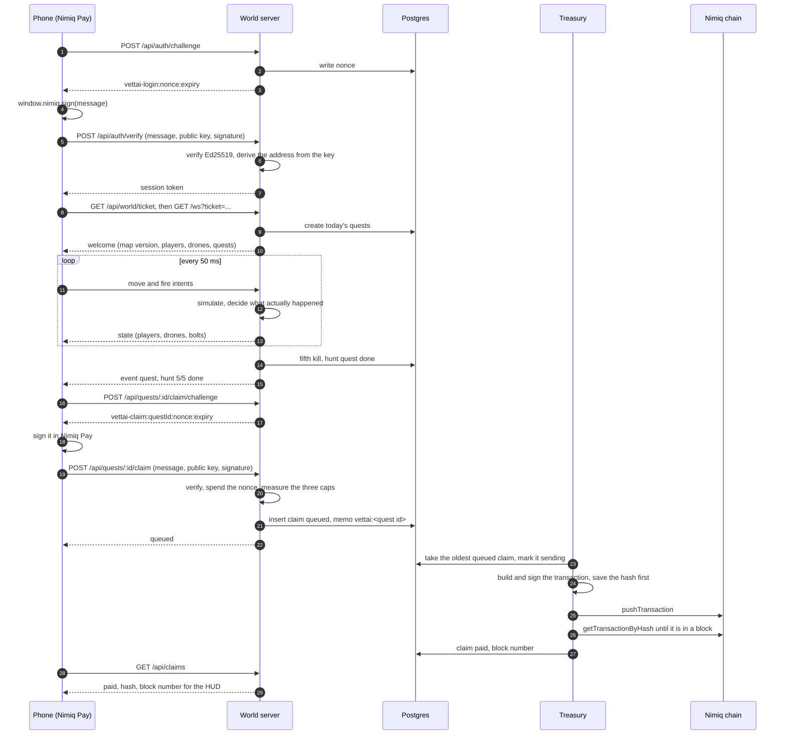

A game that pays real money has one hard problem: telling a player apart from a script that
claims to be one. Vettai answers it by never asking the player's phone for a fact.

## The core loop

**1. You open Vettai inside Nimiq Pay.** The wallet is already there, so there is nothing to
install and no account to make.

**2. You sign one message.** The server hands out a challenge that reads
`vettai-login:<nonce>:<expiry>`. Your wallet signs it. The server verifies the signature,
derives your address from the public key you sent, and spends the nonce so the same signed
message can never be used twice. You never tell the server which wallet you are. It works
that out from the key.

**3. You join the city.** A signed-in player asks for a one-minute ticket and opens a
WebSocket with it. The ticket is deleted the moment it is redeemed, so two connections
racing on one ticket cannot both get in. Your wallet is fixed to that connection before the
upgrade, and nothing you send afterwards can change whose player you are moving.

**4. You play, and the server simulates it.** Every 50 milliseconds the server integrates
your movement, slides you along building footprints, moves every drone on its patrol loop,
flies every bolt, and resolves every shot. You send a direction and an aim. You never send a
position or a kill. The answers come back as a state frame with the players that moved, the
drones that are alive and the bolts in the air.

**5. A quest finishes because the server saw it finish.** The fifth kill of the day closes
the hunt quest. A parcel dropped at the right point inside two minutes closes the courier
quest. Four landmarks touched closes the landmarks quest. The events come out of the
simulation, go through a single ordered chain of writes, and land in the database in the
order they happened.

**6. You sign again to claim.** A finished quest gets a second challenge,
`vettai-claim:<questId>:<nonce>:<expiry>`. You sign it, the server checks the signature is
from the wallet that owns the session, spends the nonce, and writes the claim row and the
quest's new state in one database transaction. Either you have a payout and a spent quest,
or you have neither.

**7. The treasury pays it.** A separate process, the only one holding a private key, picks
up queued claims, signs a Nimiq transaction with a memo carrying the quest id, saves the
hash before it broadcasts, and then polls the node until the payment is in a block. Your
claim goes from `queued` to `sent` to `paid` with the block number attached.

## Why the server is the authority

The world server holds no key. It cannot move a single luna. The treasury holds the key and
has no socket, no API and no way for a player to reach it. The world refuses to start if it
finds `TREASURY_PRIVATE_KEY` in its own environment at all.

That split means the process a player can talk to is the process that cannot pay, and the
process that can pay only ever reads rows the world already wrote. A bug in the game cannot
turn into a withdrawal.

## The same loop as a diagram

## What each side gets out of it

- The player installs nothing, deposits nothing, and can check every payout on a public
  chain by its memo.
- The operator can prove the game is honest without asking anyone to trust them, because the
  rules run on the server and the payouts run on the chain.
- Nobody has to trust Vettai with their money, because Vettai never holds any of it. The NIM
  goes from the treasury wallet to the player's wallet and nowhere else.
