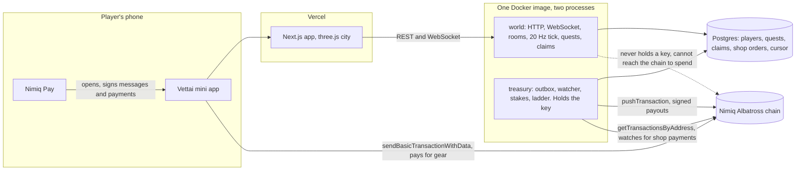
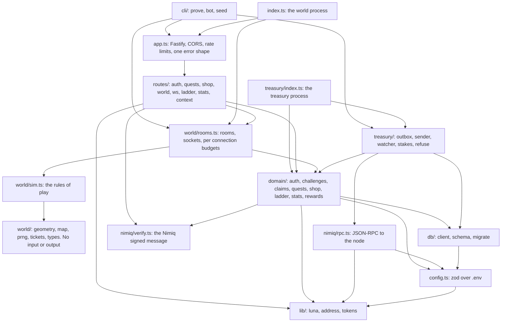

Vettai is two always-on processes built from one Docker image, sharing one Postgres
database, plus a Next.js app on the edge and the Nimiq chain underneath.

## The system, drawn

## The two processes

**world.** The HTTP API and the WebSocket. It runs the rooms, the 20 Hz tick, the quest
engine, the ladder endpoint and the claim API. It never holds a private key, and it refuses
to boot if it finds `TREASURY_PRIVATE_KEY` in its environment at all.

**treasury.** Delivers queued claims as NIM payments, watches the treasury address for shop
payments, reads stakes for the landlord quest, and pays the weekly ladder. It is the only
process with the key.

One image runs both. The host picks by setting `VETTAI_PROCESS=src/treasury/index.ts`;
unset, the image runs the world. Locally the treasury reads its key from a separate
`.env.treasury` file layered on top of `.env`.

## The database

Money amounts are integers in luna, never floats. One NIM is 100,000 luna.

| Table | What it holds |
|---|---|
| players | address (primary), public key, created and last seen, last IP hash, gear as JSON, landlord since |
| sessions | token hash (primary), address, created, expires after 30 days |
| challenges | nonce (primary), kind (login, claim or shop), subject, expiry, used at. Single use, ten minutes |
| quests | id, address, UTC day, kind, target, progress, state, reward in luna, detail JSON, created and done. Unique on address, day and kind |
| claims | id, address, quest id, kind, amount in luna, state, memo, transaction hash (unique), block number, IP hash, attempts, held until, timestamps, error. At most one claim per quest |
| shop_orders | id, address, item, price in luna, memo (unique), state, transaction hash (unique), block number, created, paid, announced |
| received_payments | every incoming transaction the watcher inspected: hash (primary), sender, recipient, value, memo, block, block time, order id, outcome, seen at |
| ladder_periods | period (primary, for example 2026-W41), paid at, the claim ids |
| stats_daily | day (primary), players, kills, luna paid |
| watch_cursor | address (primary), last block number, updated at |

## The module graph

The arrows only ever point downward. The play simulation knows nothing about the database,
the domain knows nothing about HTTP, and the treasury is the only thing that reaches the
signer.

## Identity

Login never carries an address. The server hands out `vettai-login:<nonce>:<expiry>`, the
client signs it with the wallet provider, and the server rebuilds the Nimiq signed-message
hash, verifies Ed25519 against the public key, derives the address from that key, spends the
nonce and returns a session token of the shape `vt1.<random>`, stored only as a hash.

## Configuration

Every environment key is validated with zod at boot, in one file, and a missing or bad key
fails loudly. Nothing reads an environment variable anywhere else. The full list is in
[Running locally](/docs/builders/running-locally) and [Deploying](/docs/builders/deploying).
